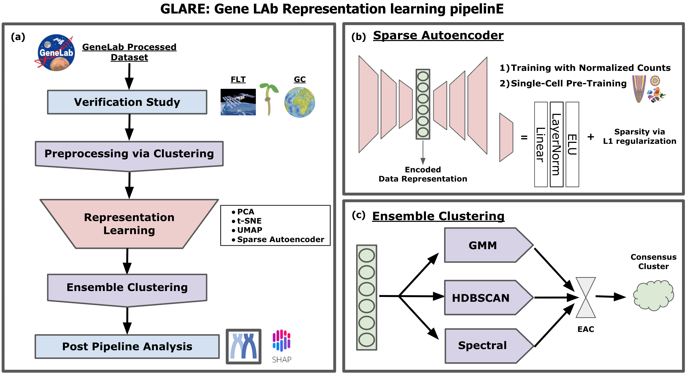

# GLARE: Discovering hidden patterns in spaceflight transcriptome using representation learning

GLARE: GeneLAb Representation learning pipelinE is a new opensource pipeline, where researchers can explore GeneLab data using different representation learning models and clustering methods to find hidden patterns in the spaceflight transcriptome data.

## Description

Spaceflight studies present novel insights into biological processes through exposure to stressors outside the evolutionary path of terrestrial organisms. Despite limited access to space environments, numerous transcriptomic datasets are available through NASA’s GeneLab data repository, which allows public access to these datasets encouraging further analysis. While various pre-defined methods are used to process transcriptomic datasets, learning-model-driven analyses are increasingly sought and have not been applied to a broad array of datasets. In this study, we propose an open-source framework, GLARE: GeneLAb Representation learning pipelinE, which consists of training different representation learning approaches from manifold learning to transfer learning that enhances the performance of the downstream tasks. We illustrate the utility of GLARE by applying it to gene-level transcriptional values from an Arabidopsis root tip transcriptome dataset that spanned light, dark, and microgravity treatments. It shows that GLARE not only substantiated the findings of the original study concerning cell wall remodeling but also revealed additional patterns affected by the treatments, including evidence of hypoxia. This work suggests there is great potential to supplement the insights drawn from their initial studies through further analysis. Using GLARE, novel transcriptional responses have been identified in root tips experiencing diverse light conditions in spaceflight.

## Proof of concept

Proof of concept study was presented at ASGSR 2021, where you can find the source code and the abstract poster at [POC_ASGSR2021](POC_ASGSR2021).
